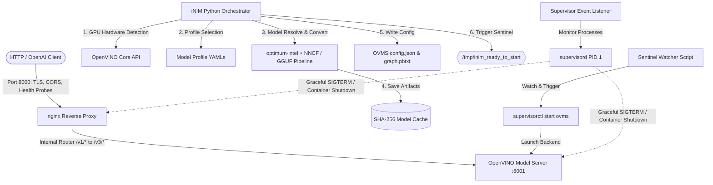

# iNIM: Comprehensive Instruction Manual & Operations Guide
## Enterprise-Grade OpenVINO™ LLM Serving Stack Optimized for Intel® GPUs

---

> [!NOTE]
> **iNIM (Intel NIM-Equivalent)** is a production-grade, containerized LLM serving stack that mirrors the architecture, design philosophy, and API surface of NVIDIA's NIM (NVIDIA Inference Microservices) but is engineered specifically for **Intel GPU hardware** (UHD integrated, Xe integrated, and Arc discrete graphics) running on Ubuntu 22.04 LTS.

---

## 📖 Table of Contents

1. [Architectural Overview](#1-architectural-overview)
2. [Host Environment Setup](#2-host-environment-setup)
   - [Hardware Requirements](#hardware-requirements)
   - [Driver & Compute Foundation](#driver--compute-foundation)
   - [Automated Setup Script](#automated-setup-script)
   - [Manual Verification](#manual-verification)
3. [Quick Start Guide](#3-quick-start-guide)
   - [Interactive Startup](#interactive-startup)
   - [Pure Docker Run](#pure-docker-run)
   - [Offsite / Air-Gapped Mode](#offsite--air-gapped-mode)
4. [Universal Model Conversion & Caching Pipeline](#4-universal-model-conversion--caching-pipeline)
   - [Format Auto-Detection](#format-auto-detection)
   - [Dynamic Profile Selection](#dynamic-profile-selection)
   - [Quantization & Precision Mapping](#quantization--precision-mapping)
   - [Cache-First SHA-256 Architecture](#cache-first-sha-256-architecture)
5. [Supported Models & GPU Tier Profiles](#5-supported-models--gpu-tier-profiles)
6. [API Surface & Integration Reference](#6-api-surface--integration-reference)
   - [OpenAI-Compatible Endpoints](#openai-compatible-endpoints)
   - [Diagnostic Probes](#diagnostic-probes)
   - [Prometheus Metrics](#prometheus-metrics)
   - [Client Code Integration Examples](#client-code-integration-examples)
7. [Advanced Configuration Options](#7-advanced-configuration-options)
   - [Master Environment Variable Table](#master-environment-variable-table)
   - [TLS Certificate Setup](#tls-certificate-setup)
   - [CORS Access Control](#cors-access-control)
8. [Developer Guide](#8-developer-guide)
   - [Local Development Setup](#local-development-setup)
   - [Running Unit Tests](#running-unit-tests)
   - [Code Quality & Linting](#code-quality--linting)
9. [Troubleshooting & Performance Diagnostics](#9-troubleshooting--performance-diagnostics)

---

## 1. Architectural Overview

At its core, **iNIM** is an enterprise orchestration layer wrapped around the **OpenVINO™ Model Server (OVMS)**. It substitutes NVIDIA/CUDA-specific components with Intel-native open-source compute layers while preserving the client-facing APIs. 

Inside the container, a robust multi-process architecture is managed by `supervisord`, utilizing a secure-by-default reverse proxy pattern and fail-fast system loops.



### Component Mapping: NIM vs. iNIM

| NIM Layer | NIM Component (NVIDIA) | iNIM Component (Intel Equivalent) | Technical Rationale |
| :--- | :--- | :--- | :--- |
| **Inference Server** | vLLM (CUDA) | **OpenVINO™ Model Server (OVMS)** | High-performance C++ serving engine with built-in continuous batching and PagedAttention for Intel architecture. |
| **Reverse Proxy** | nginx | **nginx** | Robust, lightweight reverse-proxy; parses `/v1/` routes, handles CORS, and terminates SSL/TLS. |
| **Kernel Stack** | CUDA Driver | **Intel NEO Compute Runtime** | System-level drivers implementing Level Zero and OpenCL compute APIs. |
| **GPU Toolkit** | NVIDIA Container Toolkit | **Direct Device Mount (`--device /dev/dri`)** | Native Linux Direct Rendering Infrastructure (DRI) pass-through; bypasses the need for custom container runtimes. |
| **Quantization Suite** | TensorRT-LLM / TensorRT | **optimum-intel + NNCF** | State-of-the-art weights compression (INT4, INT8, FP16) and conversion toolkit natively mapped to Intel hardware. |
| **Model Registry** | NGC (NVIDIA GPU Cloud) | **HuggingFace Hub & Local Filesystem** | Decentralized, universal support for standard weights formats from any source. |
| **Process Manager** | Custom Shell Daemon | **supervisord + fail-fast listener** | Robust process control with automated container teardown if Nginx or OVMS encounters a fatal issue. |

---

## 2. Host Environment Setup

Before launching the iNIM container, the host machine must be provisioned with the appropriate kernel modules, graphics compute runtimes, and compiler toolchains.

### Hardware Requirements

- **Processor**: Intel Core™ (Gen 11 or newer), Intel Core™ Ultra, or Intel® Xeon® processors.
- **GPU Tier Support**:
  - **Intel® UHD Graphics** (Gen 11+ integrated graphics)
  - **Intel® Xe Graphics / Iris® Xe** (Tiger Lake, Alder Lake, Raptor Lake iGPU)
  - **Intel® Arc™ Graphics** (Discrete Alchemist/Battlemage GPUs: A380, A580, A750, A770, B580, etc.)
  - **Intel® Xe LPG / LNL** (Meteor Lake / Lunar Lake integrated Arc)
- **Minimum System RAM**: 16 GB (32 GB recommended for model conversion tasks).

### Driver & Compute Foundation

OpenVINO's GPU pipeline utilizes Intel's low-level compute layer. Two drivers must be loaded:
1. **Level Zero (`libze_loader`)**: The primary high-performance API (analogous to CUDA).
2. **OpenCL 3.0**: Supported as a fallback layer.

Both compute backends are compiled on-the-fly at runtime using the **Intel Graphics Compiler (IGC)**. For discrete Arc GPUs, the host kernel must be **6.2+** (with **6.5+ HWE** recommended) to load the appropriate firmware and enable GuC/HuC scheduling.

---

### Automated Setup Script

iNIM provides an automated host configuration script located at `scripts/setup_host.sh`. It performs the following steps:
1. Installs the Ubuntu Hardware Enablement (HWE) kernel.
2. Adds the official Intel Graphics package repository.
3. Installs the Level Zero driver, OpenCL runtimes, IGC, and system diagnostic tools (`clinfo`).
4. Configures the kernel module options to enable GuC/HuC firmware.
5. Adds the current user to the `render` group for passwordless GPU access.
6. Installs and configures Docker CE if missing.

```bash
# Clone the repository
cd iNIM

# Run the host configuration utility (requires sudo permissions)
sudo bash scripts/setup_host.sh
```

> [!WARNING]
> If a new HWE kernel was installed or if kernel module files in `/etc/modprobe.d/i915.conf` were modified, you **must reboot the host machine** for changes to take effect:
> ```bash
> sudo reboot
> ```

---

### Manual Verification

Once the host reboot completes, verify that your Intel GPU is properly exposed to user-space and ready for compute workloads.

```bash
# Verify dri device nodes exist
ls -la /dev/dri

# Expected output:
# drwxr-xr-x  3 root root        80 May 21 14:00 .
# drwxr-xr-x 20 root root      4520 May 21 14:00 ..
# crw-rw----  1 root card   226,  0 May 21 14:00 card0
# crw-rw----  1 root render 226,128 May 21 14:00 renderD128  <-- CRITICAL

# Verify group membership (should include render)
groups

# Verify OpenCL / Level Zero runtimes are active
clinfo --list
```

---

## 3. Quick Start Guide

Three execution strategies are supported, depending on your target deployment environment.

### Option 1: Interactive Startup (Recommended for Local Dev)

The `scripts/run_local.sh` script automates Docker image compilation, environment configuration, interactive profile and HuggingFace token collection, volume mapping, and container execution.

```bash
# Make script executable
chmod +x scripts/run_local.sh

# Run interactive assistant
./scripts/run_local.sh
```

During execution, the script will prompt you:
- **Model Selection**: Select from pre-configured models (e.g., Llama-3.2-3B, Phi-3.5) or input any custom HuggingFace Repository ID (e.g., `mistralai/Mistral-7B-Instruct-v0.3`).
- **HuggingFace Token**: Entered to pull gated repositories. Skipped if already cached at `~/.cache/huggingface/token`.

---

### Option 2: Pure Docker Run

For production environments (Kubernetes, Compose, automated servers), launch the container using the standard `docker run` command:

```bash
# 1. Build the production iNIM image
docker build -f docker/Dockerfile -t inim:latest .

# 2. Start container with hardware passthrough
docker run -d \
  --name inim-server \
  --device /dev/dri \
  -v /dev/dri:/dev/dri \
  --group-add render \
  -p 8000:8000 \
  -e INIM_MODEL="OpenVINO/Llama-3.2-3B-Instruct-int4-ov" \
  -v inim-cache:/opt/inim/.cache \
  --restart unless-stopped \
  inim:latest
```

> [!IMPORTANT]
> The options `--device /dev/dri`, `-v /dev/dri:/dev/dri`, and `--group-add render` are **absolutely mandatory** for iNIM to access the hardware. Failing to include these parameters forces the OpenVINO engine to fall back to CPU execution, degrading serving performance.

---

### Option 3: Offsite / Air-Gapped Mode

If you deploy to an air-gapped system without internet connectivity:
1. Pre-download the model files (e.g., OpenVINO IR files or PyTorch Safetensors) to a host directory.
2. Bind-mount the model folder into the container.
3. Configure `INIM_OFFLINE=1` to prevent outbound HuggingFace Hub network calls.

```bash
docker run -d \
  --name inim-airgap \
  --device /dev/dri \
  -v /dev/dri:/dev/dri \
  --group-add render \
  -p 8000:8000 \
  -v /home/user/local_models/llama3_ir:/models/llama \
  -e INIM_MODEL="/models/llama" \
  -e INIM_OFFLINE=1 \
  -v inim-cache:/opt/inim/.cache \
  inim:latest
```

---

## 4. Universal Model Conversion & Caching Pipeline

One of iNIM's primary design advantages is its **Universal Model Source Support**. Rather than being locked into pre-converted, vendor-packaged weights, iNIM features a robust startup lifecycle orchestrator written in Python that automatically resolves, converts, and formats weights.

```
                  ┌──────────────────────────────┐
                  │   Client Configures Model    │
                  │   Local path or HF Repo ID   │
                  └──────────────┬───────────────┘
                                 │
                     [ Detect Source Format ]
                                 │
         ┌───────────────────────┼───────────────────────┐
         ▼                       ▼                       ▼
  [ OpenVINO IR ]             [ GGUF ]            [ Safetensors / PT ]
  (openvino_model.xml)      (*.gguf file)         (*.safetensors/*.bin)
         │                       │                       │
   Pass-Through        ┌─────────┴─────────┐       optimum-cli export
   Skip conversion     ▼                   ▼       Quantize (INT4/INT8)
                       Native GGUF     Universal         │
                       GenAI Pipeline  Fallback          │
                               │           │             │
                               ▼           ▼             │
                        save_pretrained  Dequantize      │
                               │         to FP16         │
                               └─────┬───┘               │
                                     ▼                   ▼
                              ┌─────────────────────────────┐
                              │     Write converted IR      │
                              │    tensors to Model Cache   │
                              └──────────────┬──────────────┘
                                             │
                                     [ Launch OVMS ]
```

### Format Auto-Detection

The orchestrator examines the source directory (or scrapes the remote HuggingFace repository using `huggingface_hub.list_repo_files`) and classifies the model source into one of three pipelines:

1. **`openvino_ir` (Pass-Through)**: The repository or folder already contains `openvino_model.xml` and `openvino_model.bin`. The orchestrator copies these directly to the cache, entirely bypassing the compiler stages.
2. **`pytorch_safetensors` (Auto-Conversion)**: PyTorch checkpoint files (`pytorch_model.bin`, `model.safetensors`) are detected. The orchestrator triggers `optimum-cli` to compile the graph into OpenVINO IR.
3. **`gguf` (llama.cpp Format)**: A single `.gguf` file is present. The orchestrator attempts to load it using the **OpenVINO GenAI Native GGUF Reader (B1)**. If the GGUF uses unsupported architectures or highly exotic quantizations, the orchestrator falls back to **Offline GGUF Dequantization + optimum-cli (B2)**.

---

### Dynamic Profile Selection

If `INIM_MODEL_PROFILE` is not manually configured, iNIM automatically profiles your GPU hardware at startup and pairs it with the most efficient configuration defined in the model's manifest YAML.

```python
# The profile selection algorithm filters, matches, and ranks profiles:
1. Query core.available_devices and check properties (FULL_DEVICE_NAME, GPU_DEVICE_TOTAL_MEM_SIZE).
2. Filter manifest profiles to keep those where:
   - GPU VRAM matches or exceeds the profile's minimum requirements (min_vram_mb).
   - The GPU architecture type matches the profile's allowable tiers (arch_tiers).
3. If multiple profiles match, apply the priority hierarchy:
   - Tier priority: discrete with XMX (arc-hq) > standard discrete (arc) > integrated (igpu).
   - Precision preference: lowest precision (int4 > int8 > fp16).
   - Pipeline preference: continuous batching (cb) > stateful (st).
```

---

### Quantization & Precision Mapping

When executing a format compilation, the orchestrator dynamically maps the selected profile's target precision to command-line parameters passed directly to `optimum-cli` and the Neural Network Compression Framework (NNCF):

| Requested Precision Profile | optimum-cli Target Flags | Ideal GPU Tier | Key Hardware Feature |
| :--- | :--- | :--- | :--- |
| **`fp16`** | `--weight-format fp16` | Arc A770 (16GB), B580 (12GB) | High VRAM Bandwidth |
| **`int8`** | `--weight-format int8` | Arc A380 (6GB), Xe iGPU | Standard Compute |
| **`int4`** | `--weight-format int4 --group-size 128 --ratio 1.0` | Arc GPUs with XMX, Core Ultra | Intel Matrix Extensions |
| **`int4-sym`** | `--weight-format int4 --group-size -1` | Legacy UHD Intel Graphics | Vector Processing Unit |

---

### Cache-First SHA-256 Architecture

To minimize container initialization latency, iNIM utilizes a stateful cache managed at `INIM_CACHE_PATH`.

- **Hash Generation**: The orchestrator calculates a unique SHA-256 identifier based on the `model_name`, the selected `precision_profile`, and file attributes.
- **Manifest Checksum**: A metadata manifest file `.inim_cache_manifest.json` is stored alongside the model files.
- **Start-up Bypass**: On successive startups, the orchestrator verifies the cache directory, matches the checksums, and launches OVMS immediately. A converted 7B model starts up in **under 5 seconds** on successive runs.

---

## 5. Supported Models & GPU Tier Profiles

iNIM ships with built-in hardware manifests for popular open-source model families. Custom manifests can be placed in `configs/manifests/` or mounted to `/opt/inim/etc/manifests/`.

### Pre-Configured Manifest Catalog

1. **Meta Llama 3.2 3B Instruct** (`llama-3.2-3b-instruct.yaml`)
   - Pre-converted: `OpenVINO/Llama-3.2-3B-Instruct-int4-ov`
   - Optimized profiles: `ovms-int4-arc-hq-cb`, `ovms-int4-igpu-cb`
2. **Microsoft Phi 3.5 Mini Instruct** (`phi-3.5-mini-instruct.yaml`)
   - Pre-converted: `OpenVINO/Phi-3.5-mini-instruct-int4-ov`
   - Optimized profiles: `ovms-int4-arc-hq-cb`, `ovms-int4-igpu-st`
3. **Alibaba Qwen 3 8B** (`qwen3-8b.yaml`)
   - Pre-converted: `OpenVINO/Qwen3-8B-int4-ov`
   - Optimized profiles: `ovms-int4-arc-hq-cb`, `ovms-int8-arc-cb`
4. **Mistral 7B Instruct v0.3** (`mistral-7b-instruct-v0.3.yaml`)
   - Pre-converted: `OpenVINO/Mistral-7B-Instruct-v0.3-int4-ov`
   - Optimized profiles: `ovms-int4-arc-hq-cb`

### GPU Hardware Tier Recommendations

```
┌─────────────────────────────────────────────────────────────────────────────┐
│                            iNIM GPU Tier Matrix                             │
├──────────────────┬─────────────────┬──────────────────┬─────────────────────┤
│ GPU Tier Class   │ Typical SKUs    │ Default Profile  │ Max Model Size      │
├──────────────────┼─────────────────┼──────────────────┼─────────────────────┤
│ UHD Graphics     │ UHD 770, 730    │ ovms-int4-igpu-st│ ~1B parameters      │
│ Xe / Xe-LPG iGPU │ Ultra 5/7, Iris │ ovms-int4-igpu-cb│ 3B - 7B parameters  │
│ Arc Entry (6GB)  │ Arc A380, A310  │ ovms-int4-arc-cb │ 7B parameters       │
│ Arc Mid (8GB+)   │ A580, A750      │ ovms-int4-arc-hq │ 7B - 13B parameters │
│ Arc High (16GB)  │ A770, B580      │ ovms-fp16-arc-cb │ 13B - 30B parameters│
└──────────────────┴─────────────────┴──────────────────┴─────────────────────┘
```

---

## 6. API Surface & Integration Reference

All interactions pass through the secure Nginx reverse proxy on port `8000`. nginx translates the standard NIM `/v1/` routes to the internal OpenVINO `/v3/` API.

### OpenAI-Compatible Endpoints

#### 1. Models Listing
Retrieve lists of active serving engines.

```bash
curl http://localhost:8000/v1/models
```
*Expected Response:*
```json
{
  "object": "list",
  "data": [
    {
      "id": "llama-3.2-3b-instruct",
      "object": "model",
      "created": 1716300000,
      "owned_by": "openvino"
    }
  ]
}
```

---

#### 2. Chat Completions (Standard REST)
Send conversational context to generate complete responses.

```bash
curl http://localhost:8000/v1/chat/completions \
  -H "Content-Type: application/json" \
  -d '{
    "model": "llama-3.2-3b-instruct",
    "messages": [
      {"role": "user", "content": "What is the capital of France?"}
    ],
    "max_tokens": 100,
    "temperature": 0.7
  }'
```
*Expected Response:*
```json
{
  "id": "chatcmpl-12345",
  "object": "chat.completion",
  "created": 1716300021,
  "model": "llama-3.2-3b-instruct",
  "choices": [
    {
      "index": 0,
      "message": {
        "role": "assistant",
        "content": "The capital of France is Paris."
      },
      "finish_reason": "stop"
    }
  ],
  "usage": {
    "prompt_tokens": 15,
    "completion_tokens": 7,
    "total_tokens": 22
  }
}
```

---

#### 3. Chat Completions (Server-Sent Events Streaming)
Request real-time token generation streams (`"stream": true`).

```bash
curl http://localhost:8000/v1/chat/completions \
  -H "Content-Type: application/json" \
  -d '{
    "model": "llama-3.2-3b-instruct",
    "messages": [
      {"role": "user", "content": "Write a short poem about Intel GPUs."}
    ],
    "stream": true
  }'
```
*Expected Response (SSE Stream chunks):*
```
data: {"id":"chatcmpl-567","choices":[{"index":0,"delta":{"role":"assistant","content":"Silicon"},"finish_reason":null}]}

data: {"id":"chatcmpl-567","choices":[{"index":0,"delta":{"content":" shines"},"finish_reason":null}]}

data: {"id":"chatcmpl-567","choices":[{"index":0,"delta":{"content":" bright"},"finish_reason":null}]}

data: [DONE]
```

---

### Diagnostic Probes

To facilitate robust cloud orchestrations (Kubernetes `livenessProbe` and `readinessProbe`), iNIM splits health check behaviors.

- **Liveness Probe (`GET /v1/health/live`)**: Answers immediately with code `200` to show Nginx is up.
  ```bash
  curl -i http://localhost:8000/v1/health/live
  # HTTP/1.1 200 OK
  # {"status":"ok"}
  ```
- **Readiness Probe (`GET /v1/health/ready`)**: Performs an end-to-end health check. It returns code `503 Service Unavailable` while the orchestrator compiles models, and returns code `200 OK` once OVMS has loaded the weights into the GPU.
  ```bash
  curl -i http://localhost:8000/v1/health/ready
  # HTTP/1.1 200 OK
  # {"status":"Ready"}
  ```

---

### Prometheus Metrics

OVMS native telemetry is exposed on `/v1/metrics`. It provides production telemetry including request latencies, throughput, GPU utilization, active sequence allocations, and KV cache usage.

```bash
curl http://localhost:8000/v1/metrics
```
*Sample Output:*
```
# HELP ovms_requests_success_total Total number of successful inference requests
# TYPE ovms_requests_success_total counter
ovms_requests_success_total{model_name="llama-3.2-3b-instruct"} 421

# HELP ovms_kv_cache_usage_ratio KV Cache Usage Ratio
# TYPE ovms_kv_cache_usage_ratio gauge
ovms_kv_cache_usage_ratio{model_name="llama-3.2-3b-instruct"} 0.34
```

---

### Client Code Integration Examples

#### Python Integration (Official `openai` SDK)

```python
import os
from openai import OpenAI

# Initialize the client pointing to the iNIM local proxy port
client = OpenAI(
    base_url="http://localhost:8000/v1",
    api_key="not-needed-for-inim"  # Passed to satisfy client syntax
)

# Stream responses
response_stream = client.chat.completions.create(
    model="llama-3.2-3b-instruct",
    messages=[
        {"role": "system", "content": "You are a helpful assistant."},
        {"role": "user", "content": "Explain Level Zero compute API in one sentence."}
    ],
    stream=True,
    max_tokens=150
)

for chunk in response_stream:
    content = chunk.choices[0].delta.content
    if content:
        print(content, end="", flush=True)
print()
```

---

## 7. Advanced Configuration Options

Fine-tune iNIM's pipeline and security behavior using environment variables.

### Master Environment Variable Table

| Variable | Default | Description | Impact / Security Context |
| :--- | :--- | :--- | :--- |
| `INIM_MODEL` | *(none)* | HuggingFace Repository ID or a container local absolute path. | **Required.** Determines what model is loaded. |
| `INIM_MODEL_PROFILE` | `auto` | Pinned configuration profile ID (e.g. `ovms-int4-arc-hq-cb`). | Bypasses the auto-profiler and locks hardware defaults. |
| `INIM_SERVER_PORT` | `8000` | Port Nginx uses to expose API services. | Adjusts container network boundaries. |
| `INIM_CACHE_PATH` | `/opt/inim/.cache` | Cache folder path for storing model files. | Should be mapped to a persistent volume for faster restarts. |
| `INIM_LOG_LEVEL` | `info` | Orchestrator logging details (`debug`, `info`, `warning`, `error`). | Controls operational visibility. |
| `INIM_OFFLINE` | `0` | Disables remote HuggingFace Hub network calls (`0` or `1`). | Enables air-gapped system isolation. |
| `INIM_READY_TIMEOUT` | `300` | Seconds to wait for OVMS to complete model load. | Avoids container restart loop during heavy initial model loads. |
| `HF_TOKEN` | *(none)* | HuggingFace credentials token. | Required to download gated repositories. |
| `INIM_TLS_CERT_PATH` | *(none)* | Path inside the container to a PEM TLS public certificate. | Injects SSL configs into nginx for HTTPS serving. |
| `INIM_TLS_KEY_PATH` | *(none)* | Path inside the container to a PEM TLS private key. | Mandatory alongside `INIM_TLS_CERT_PATH`. |
| `INIM_ALLOWED_ORIGINS`| `*` | Custom CORS allowed origins string. | Secures cross-origin web browser connections. |
| `OVMS_LOG_LEVEL` | `INFO` | Back-end logging verbosity (`INFO`, `ERROR`, `DEBUG`). | Logs continuous batching details directly. |

---

### TLS Certificate Setup

To secure communication between clients and the iNIM container, configure TLS on the Nginx front-end by mounting certificate files and providing environmental paths:

```bash
docker run -d \
  --name inim-secure \
  --device /dev/dri \
  -v /dev/dri:/dev/dri \
  --group-add render \
  -p 8443:8443 \
  -v /etc/letsencrypt/live/inim.domain.com/fullchain.pem:/certs/cert.pem:ro \
  -v /etc/letsencrypt/live/inim.domain.com/privkey.pem:/certs/key.pem:ro \
  -e INIM_SERVER_PORT=8443 \
  -e INIM_TLS_CERT_PATH="/certs/cert.pem" \
  -e INIM_TLS_KEY_PATH="/certs/key.pem" \
  -e INIM_MODEL="OpenVINO/Llama-3.2-3B-Instruct-int4-ov" \
  -v inim-cache:/opt/inim/.cache \
  inim:latest
```

---

### CORS Access Control

For production systems, avoid wildcard CORS setups. Bind custom origins using `INIM_ALLOWED_ORIGINS`:

```bash
# Lock down requests strictly to corporate frontend domains
docker run -d \
  -e INIM_ALLOWED_ORIGINS="https://chatbot.company.internal" \
  ...
  inim:latest
```

---

## 8. Developer Guide

The iNIM codebase is organized into modules to support testing, expansion, and development.

### Local Development Setup

To write custom converters, add new profiles, or modify the orchestrator pipeline:

```bash
# 1. Create a Python virtual environment
python3 -m venv venv
source venv/bin/activate

# 2. Install development packages with editable source
pip install -e ".[dev]"
```

### Running Unit Tests

The test suite validates components using mock OpenVINO runtimes, meaning **no active Intel GPU hardware is required to run the test suite.**

```bash
# Execute the complete unit test catalog
pytest tests/ -v --cov=src/
```

Test catalog structure:
- `tests/test_gpu_detector.py`: Validates GPU platform parsing.
- `tests/test_profile_selector.py`: Tests profile resolution matching logic.
- `tests/test_format_detector.py`: Exercises HuggingFace metadata and local file path parsers.
- `tests/test_cache_manager.py`: Tests SHA-256 metadata verification.
- `tests/test_ovms_configurator.py`: Ensures correct MediaPipe graphs and configurations are written.

---

### Code Quality & Linting

Maintain code standards using `ruff` and `mypy` before committing changes:

```bash
# Lint code
ruff check src/

# Static type check
mypy src/inim/
```

---

## 9. Troubleshooting & Performance Diagnostics

### 1. Host Device Nodes Missing or Permissions Issue
* **Symptom**: `clinfo` returns empty platforms list, or orchestrator reports `"No GPU detected"`.
* **Fix**:
  1. Ensure the user running the docker process is in the `render` group.
  2. Verify that `--device /dev/dri` is explicitly mounted.
  3. On host, ensure rendering nodes are active: `ls -l /dev/dri/renderD*`.
  4. Ensure kernel modules are properly loaded with `sudo modprobe i915` or `sudo modprobe xe`.

### 2. Out of Memory (OOM) During Model Conversion
* **Symptom**: The container crashes or the terminal reports `Killed` while running `optimum-cli`.
* **Fix**: Model conversion is memory-intensive. 
  1. Ensure you have at least 32GB of total system memory (RAM + swap space).
  2. Map pre-converted OpenVINO IR weights directly (`OpenVINO/Llama-3.2-3B-Instruct-int4-ov`) instead of raw safetensors, completely avoiding local compiler execution.

### 3. OpenVINO Model Server Fails to Start (Ready Probe Timeout)
* **Symptom**: Container logs show `/v1/health/ready` consistently returning `503`, and the container shuts down after 5 minutes.
* **Fix**: Large models (7B+ parameters) or systems using slow storage can take longer than the default 300 seconds to load the model into memory. Increase the timeout by setting the environment variable `-e INIM_READY_TIMEOUT=600`.

### 4. Continuous Batching Performance Degradation
* **Symptom**: Response latency is high under multi-user concurrency.
* **Fix**:
  1. Check `/v1/metrics` for high `ovms_kv_cache_usage_ratio`.
  2. Enable Dynamic Quantization in custom manifests or override execution limits.
  3. Ensure the host is using a discrete GPU or Xe Core Ultra with fast dual-channel system memory (RAM bandwidth determines integrated GPU performance).

---

*Intel, OpenVINO, Iris, and Core Ultra are registered trademarks of Intel Corporation.*
*NVIDIA and NIM are trademarks of NVIDIA Corporation.*
